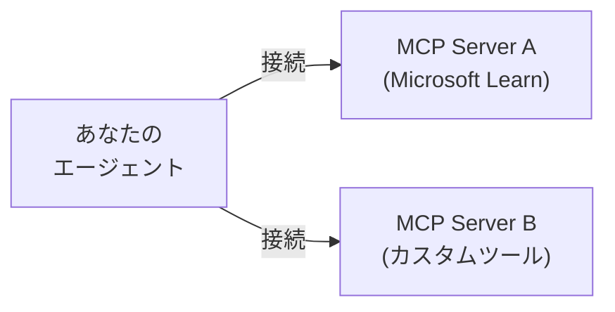

# 🔌 フェーズ 6: MCP 統合

!!! info "所要時間"
    約15分

## 🎯 学習目標

- MCP とは何かを理解する
- エージェントを MCP サーバーに接続する
- ローカルツールと MCP ツールを組み合わせる
- Agent Framework の MCP サポートを活用する

---

## 🤔 MCP とは？

**MCP（Model Context Protocol）** は、AI エージェントとツールを接続するためのオープン標準です。



### MCP なし vs MCP あり

**MCP なし：** 各 AI アプリがローカルにツールを定義。ツールの再利用ができず、アプリごとに同じロジックを書く必要がある。

**MCP あり：** 外部の MCP サーバーが複数の AI アプリにツールを提供。ツールの共有・再利用が容易。

### なぜ MCP を使うのか？

| メリット | 説明 |
|---------|------|
| 再利用可能 | 1つのサーバーを複数のアプリで利用 |
| モジュール式 | コード変更なしでツールを追加 |
| 標準規格 | Claude、ChatGPT、自作エージェントで動作 |

---

## 📁 ステップ 1: プロジェクトフォルダを作成

phase-03 ディレクトリにいる場合は、`cd ..` でワークスペースのルートに戻りましょう。
そして以下のコマンドを実行します。

=== "macOS / Linux"

    ```bash
    mkdir -p phase-06
    cd phase-06
    touch app.py
    ```

=== "Windows (PowerShell)"

    ```powershell
    mkdir phase-06
    cd phase-06
    New-Item app.py
    ```

---

## 📋 ステップ 2: フェーズ 5 からファイルをコピー

=== "macOS / Linux"

    ```bash
    cp ../phase-05/tools.py .
    ```

=== "Windows (PowerShell)"

    ```powershell
    Copy-Item ..\phase-05\tools.py .
    ```

ここまでの手順が完了すると、プロジェクトは以下の構成になります。

```text
cogbot-handson/
├── .venv/
├── phase-02/
├── phase-03/
├── phase-04/
├── phase-05/
├── phase-06/
|     └── app.py
|     └── tools.py
├── .env
├── .gitignore
└── requirements.txt
```

---

## 🔧 ステップ 3: MCP ツールを追加

`app.py` を更新して MCP サーバーに接続します。

```python title="app.py"
import os
from datetime import date
import chainlit as cl
from dotenv import load_dotenv
from agent_framework import Agent, Content, MCPStreamableHTTPTool
from agent_framework.azure import AzureOpenAIChatClient
from tools import TOOLS

load_dotenv(override=True)

SYSTEM_PROMPT = f"""あなたは、Aria という名の役に立つ AI アシスタントです。

複数のツールにアクセスできます。
- ローカルツール: 天気予報のクエリには get_weather をご利用ください。
- MCP ツール: 技術的な質問には Microsoft Learn ドキュメントをご利用ください。

ガイドライン:
- 天気予報には get_weather を使用してください。
- Azure、クラウド、Microsoft の技術に関する質問には、利用可能な MCP ツールをご利用ください。

現在時刻: {date.today().strftime("%B %d, %Y")}
"""


def get_chat_client():
    """Azure OpenAI Chat クライアント"""
    return AzureOpenAIChatClient(
        endpoint=os.environ["MSF_MODEL_ENDPOINT"],
        api_key=os.environ["MSF_MODEL_API_KEY"],
        api_version=os.environ["MSF_MODEL_API_VERSION"],
        deployment_name=os.environ["MSF_MODEL_DEPLOYMENT_NAME"]
    )


def get_mcp_tools():
    """
    外部サーバーから MCP ツールを取得。

    MCP により外部ツールサーバーに接続可能。
    エージェントにツールを提供する MCP サーバーを設定します。
    """
    mcp_tools = []

    try:
        # Microsoft Learn のドキュメントを検索可能な Microsoft Learn MCP サーバーを追加
        mcp_tools.append(
            MCPStreamableHTTPTool(
                name="microsoft_learn",
                description="Microsoft Learn ドキュメントを検索するツール。Azure、クラウド、Microsoft の技術に関する質問に使用してください。",
                url="https://learn.microsoft.com/api/mcp"
            )
        )
    except Exception as e:
        print(f"警告: Microsoft Learn MCP サーバーに接続できませんでした: {e}")

    return mcp_tools


def create_agent():
    """設定済みの Agent を作成"""
    chat_client = get_chat_client()
    mcp_tools = get_mcp_tools()
    # Agent を作成
    agent: Agent = chat_client.as_agent(
        name="Aria",
        description="Tools を備えた便利なAIアシスタント",
        instructions=SYSTEM_PROMPT,
        tools=[*TOOLS, *mcp_tools],  # ローカルと MCP の tools を追加
        default_options={
            # "temperature": 0.7,
            "max_completion_tokens": 3000,
            "reasoning_effort": "none"  # reasoning model で指定可能
        }
    )

    return agent


@cl.on_chat_start
async def start():
    """チャットセッションを初期化"""
    agent = create_agent()
    session = agent.create_session()

    cl.user_session.set("agent", agent)
    cl.user_session.set("session", session)

    await cl.Message(content="👋 こんにちは🌞Aria です。").send()


@cl.on_message
async def main(message: cl.Message):
    agent: Agent = cl.user_session.get("agent")
    session = cl.user_session.get("session")

    msg = cl.Message(content="")
    tool_steps = {}

    stream = agent.run(message.content, stream=True, session=session)
    async for update in stream:
        # Tool call のストリーミング
        if update.contents:
            for content in update.contents:
                # Tool call 開始時
                if isinstance(content, Content) and content.type == "function_call":
                    if content.name and content.call_id not in tool_steps:
                        tool_steps[content.call_id] = cl.Message(content=f"🔧 ツールを呼び出し中: {content.name}...")
                        step = cl.Step(
                            name=f"🔧 {content.name}",
                            type="tool"
                        )
                        await step.send()
                        tool_steps[content.call_id] = step
                # Tool call 後の結果
                elif isinstance(content, Content) and content.type == "function_result":
                    if content.call_id in tool_steps:
                        step = tool_steps[content.call_id]
                        step.output = str(content.result)
                        await step.update()
        # テキストの応答のストリーミング
        if update.text:
            await msg.stream_token(update.text)

    await stream.get_final_response()  # 会話履歴を session に自動保存
    await msg.send()

```

---

## 🧠 ステップ 4: Agent Framework の MCP を理解する

### 主要コンポーネント

| コンポーネント | 説明 |
|-------------|------|
| `MCPStreamableHTTPTool` | HTTP 経由で外部 MCP サーバーに接続 |
| `name` | MCP サーバーの識別名 |
| `url` | MCP サーバーのエンドポイント URL |

### 仕組み

- `MCPStreamableHTTPTool` は HTTP 経由で外部 MCP Sever に接続します。
- tools (tool の一覧) は MCP Server へ接続時に **自動的に検出**されます。
- ローカルツールとリスト連結（`[*TOOLS, *mcp_tools]`）で結合します。
- `try/except` でサーバー不稼働時の起動失敗を回避します。

!!! tip "ポイント"
    MCP ツールはサーバーから自動的に検出されるため、ツールのスキーマを手動で定義する必要はありません。

### 利用可能な MCP サーバー

| サーバー | URL | 用途 |
|---------|-----|------|
| Microsoft Learn | `https://learn.microsoft.com/api/mcp` | Azure・クラウド・技術ドキュメント |
| カスタムサーバー | `https://your-server.com/mcp` | 独自の MCP 互換サーバー |

### MCP サーバーの追加

新しい MCP サーバーを追加するには、`get_mcp_tools()` 関数に追加するだけです：

```python
def get_mcp_tools():
    mcp_tools = []

    try:
        # Microsoft Learn MCP サーバー
        mcp_tools.append(
            MCPStreamableHTTPTool(
                name="microsoft_learn",
                url="https://learn.microsoft.com/api/mcp"
            )
        )

        # 別の MCP サーバーを追加する例
        # mcp_tools.append(
        #     MCPStreamableHTTPTool(
        #         name="custom_server",
        #         url="https://your-server.com/mcp"
        #     )
        # )
    except Exception as e:
        print(f"警告: MCP サーバーに接続できませんでした: {e}")

    return mcp_tools
```

---

## 🚀 ステップ 5: 実行とテスト

アプリケーションを起動します：

```bash
chainlit run app.py -w
```

### テストシナリオ

**テスト 1: ローカルツール（天気）**

```
ロンドンとパリの天気は、どちらが暖かいですか
```

**テスト 2: MCP ツール（Microsoft Learn ドキュメント）**

```
Azure CLI でストレージアカウントを作成するには？
```

**テスト 3: 一般的な質問（ツール不要）**

```
Python とは？
```

!!! note "確認"
    各テストで以下を確認してください：

    - ローカルツール呼び出し時に `🔧 get_weather` ステップが表示される
    - MCP の tool caling 時に microsoft_learn の tools (`microsoft_docs_search`, `microsoft_docs_fetch`, `microsoft_code_sample_search`) のステップが表示される
    - 一般的な質問ではツールステップが表示されない

---

## 💡 ポイント

- **MCP** は AI エージェントとツールを接続するオープン標準
- **MCPStreamableHTTPTool** で外部 MCP サーバーに簡単に接続可能
- ローカルツールと MCP ツールは**シームレスに組み合わせ**られる
- MCP サーバーの追加は**コードの変更なし**で対応可能（設定の追加のみ）
- ツールは MCP サーバーから**自動的に検出**される

---

## ✅ チェックポイント

このフェーズを完了すると、以下ができるようになります：

- [x] MCP の概念と利点を理解した
- [x] Agent Framework で MCP サーバーに接続できた
- [x] ローカルツールと MCP ツールを組み合わせた
- [x] 天気（ローカル）と Microsoft Learn（MCP）の両方の利用の動作確認ができた

??? example "完成コード: app.py（クリックで展開）"

    ```python
    --8<-- "solutions/phase-06/app.py"
    ```

---

## 🎉 ワークショップ完了 🎉

おめでとうございます！すべてのフェーズを完了しました！

このワークショップで学んだこと：

1. **フェーズ 1**: 開発環境のセットアップ
2. **フェーズ 2**: Microsoft Foundry への 接続
3. **フェーズ 3**: Chainlit の基本
4. **フェーズ 4**: Agent Framework の導入
5. **フェーズ 5**: Tool Calling
6. **フェーズ 6**: MCP 統合

シンプルな API 呼び出しから、ローカルツールと外部 MCP サーバーを活用する本格的な AI エージェントを構築できました。
ここから先は、さらに多くの MCP サーバーを追加したり、独自のツールを作成したりして、エージェントの機能を拡張していきましょう！ 🚀
